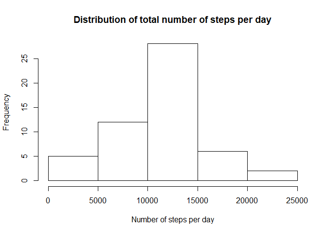
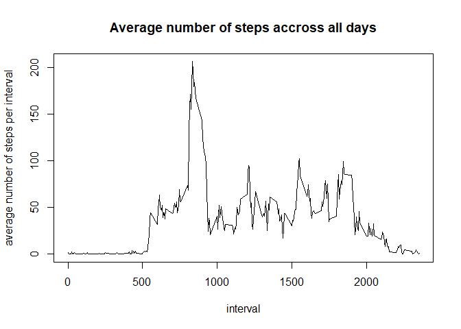
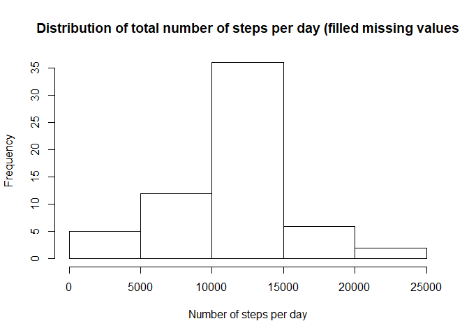
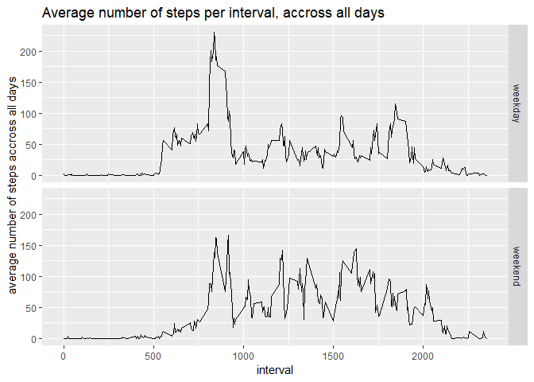

## Loading required packages


```r
if(!"ggplot2" %in% rownames(installed.packages())) {install.packages("ggplot2")}
if(!"dplyr" %in% rownames(installed.packages())) {install.packages("dplyr")}
if(!"knitr" %in% rownames(installed.packages())) {install.packages("knitr")}
library(ggplot2)
library(dplyr)
```

```
## 
## Attaching package: 'dplyr'
```

```
## The following objects are masked from 'package:stats':
## 
##     filter, lag
```

```
## The following objects are masked from 'package:base':
## 
##     intersect, setdiff, setequal, union
```

```r
library(knitr)
## set all chunks with echo =TRUE
opts_chunk$set(echo = TRUE)
```

## Loading and preprocessing the data

Show any code that is needed to

1. Load the data (i.e. \color{red}{\verb|read.csv()|}read.csv())
2. Process/transform the data (if necessary) into a format suitable for your analysis


```r
## Download and unzip data into the working directory
download.file("https://d396qusza40orc.cloudfront.net/repdata%2Fdata%2Factivity.zip", "activity.zip")
unzip("activity.zip")
## Read the data
df_activity_all<-read.csv("activity.csv", stringsAsFactors = FALSE)
## Transform the data
df_activity_all$date<-as.Date(df_activity_all$date)
## Display data and sumary
head(df_activity_all, 10)
```

```
##    steps       date interval
## 1     NA 2012-10-01        0
## 2     NA 2012-10-01        5
## 3     NA 2012-10-01       10
## 4     NA 2012-10-01       15
## 5     NA 2012-10-01       20
## 6     NA 2012-10-01       25
## 7     NA 2012-10-01       30
## 8     NA 2012-10-01       35
## 9     NA 2012-10-01       40
## 10    NA 2012-10-01       45
```

```r
summary(df_activity_all)
```

```
##      steps             date               interval     
##  Min.   :  0.00   Min.   :2012-10-01   Min.   :   0.0  
##  1st Qu.:  0.00   1st Qu.:2012-10-16   1st Qu.: 588.8  
##  Median :  0.00   Median :2012-10-31   Median :1177.5  
##  Mean   : 37.38   Mean   :2012-10-31   Mean   :1177.5  
##  3rd Qu.: 12.00   3rd Qu.:2012-11-15   3rd Qu.:1766.2  
##  Max.   :806.00   Max.   :2012-11-30   Max.   :2355.0  
##  NA's   :2304
```


## What is mean total number of steps taken per day?
For this part of the assignment, you can ignore the missing values in the dataset.


```r
##remove missing values
df_activity<-df_activity_all[!is.na(df_activity_all$steps),]
```
1. Calculate the total number of steps taken per day


```r
##Compute total number of steps for each date in the dataset
df_total_day<-group_by(df_activity, date)
df_total_day<-summarise(df_total_day, total=sum(steps))
```

2. If you do not understand the difference between a histogram and a barplot, research the difference between them. Make a histogram of the total number of steps taken each day


```r
## print histogram
hist(df_total_day$total, xlab="Number of steps per day", main="Distribution of total number of steps per day")
```

<!-- -->

3. Calculate and report the mean and median of the total number of steps taken per day


```r
## run the summary
summary(df_total_day)
```

```
##       date                total      
##  Min.   :2012-10-02   Min.   :   41  
##  1st Qu.:2012-10-16   1st Qu.: 8841  
##  Median :2012-10-29   Median :10765  
##  Mean   :2012-10-30   Mean   :10766  
##  3rd Qu.:2012-11-16   3rd Qu.:13294  
##  Max.   :2012-11-29   Max.   :21194
```

```r
##compute mean and median
mean_total_steps<-mean(df_total_day$total)
median_total_steps<-median(df_total_day$total)
```

The mean total number of steps taken per day is: 10766

The median total number of steps taken per day is: 10765

## What is the average daily activity pattern?

1. Make a time series plot (i.e. type="l") of the 5-minute interval (x-axis) and the average number of steps taken, averaged across all days (y-axis)


```r
##compute average number of steps for each intervals accross all days
df_average_steps<-aggregate(steps~interval, df_activity_all, FUN=mean)
##Plot the time series
plot(df_average_steps, type="l", ylab="average number of steps per interval", main="Average number of steps accross all days")
```

<!-- -->

2. Which 5-minute interval, on average across all the days in the dataset, contains the maximum number of steps?


```r
## print summary
summary(df_average_steps)
```

```
##     interval          steps        
##  Min.   :   0.0   Min.   :  0.000  
##  1st Qu.: 588.8   1st Qu.:  2.486  
##  Median :1177.5   Median : 34.113  
##  Mean   :1177.5   Mean   : 37.383  
##  3rd Qu.:1766.2   3rd Qu.: 52.835  
##  Max.   :2355.0   Max.   :206.170
```

```r
## find the 5-minute interval for which the max is attained 
max_inter<-df_average_steps[which.max(df_average_steps$steps),]$interval
```
The interval 835 contains the maximum number of steps, on average accross all the days in the dataset

## Imputing missing values

Note that there are a number of days/intervals where there are missing values (coded as NA). The presence of missing days may introduce bias into some calculations or summaries of the data.

1. Calculate and report the total number of missing values in the dataset (i.e. the total number of rows with NAs)


```r
number_NA<-sum(is.na(df_activity_all))
```

The dataset contains 2304 missing values.

2. Devise a strategy for filling in all of the missing values in the dataset. The strategy does not need to be sophisticated. For example, you could use the mean/median for that day, or the mean for that 5-minute interval, etc.

```r
## this function will fill the missing values with mean for the corresponding interval
fill_missing_mean<-function(dataset_missing, dataset_average){
       for (i in 1:nrow(dataset_missing)){
               if(is.na(dataset_missing$steps[i])){
                 missing_interval<-dataset_missing$interval[i]
                 mean_interval<-dataset_average$steps[dataset_average$interval == missing_interval]
                dataset_missing$steps[i]<- mean_interval
                }
       }
        
        dataset_missing
}
```


3. Create a new dataset that is equal to the original dataset but with the missing data filled in.


```r
df_activity_filled<-fill_missing_mean(df_activity_all, df_average_steps)
head(df_activity_filled)
```

```
##       steps       date interval
## 1 1.7169811 2012-10-01        0
## 2 0.3396226 2012-10-01        5
## 3 0.1320755 2012-10-01       10
## 4 0.1509434 2012-10-01       15
## 5 0.0754717 2012-10-01       20
## 6 2.0943396 2012-10-01       25
```

```r
summary(df_activity_filled)
```

```
##      steps             date               interval     
##  Min.   :  0.00   Min.   :2012-10-01   Min.   :   0.0  
##  1st Qu.:  0.00   1st Qu.:2012-10-16   1st Qu.: 588.8  
##  Median :  0.00   Median :2012-10-31   Median :1177.5  
##  Mean   : 37.38   Mean   :2012-10-31   Mean   :1177.5  
##  3rd Qu.: 27.00   3rd Qu.:2012-11-15   3rd Qu.:1766.2  
##  Max.   :806.00   Max.   :2012-11-30   Max.   :2355.0
```


4. Make a histogram of the total number of steps taken each day and Calculate and report the mean and median total number of steps taken per day. Do these values differ from the estimates from the first part of the assignment? What is the impact of imputing missing data on the estimates of the total daily number of steps?


```r
##Compute total number of steps for each date in the dataset
df_total_day_filled<-group_by(df_activity_filled, date)
df_total_day_filled<-summarise(df_total_day_filled, total=sum(steps))
## print histogram
hist(df_total_day_filled$total, xlab="Number of steps per day", main="Distribution of total number of steps per day (filled missing values")
```

<!-- -->

```r
#Compute mean and median
mean_total_steps_filled<-mean(df_total_day_filled$total)
median_total_steps_filled<-median(df_total_day_filled$total)
diff_mean<-mean_total_steps_filled - mean_total_steps
diff_med<-median_total_steps_filled - median_total_steps
```
After inputting missing values with the mean for the respective interval, the mean total number of steps taken per day is: 10766 , and the median total number of steps taken per day is: 10765

Difference in mean with original set: 0

Difference in median with original set: 1.1886792

There is a slight difference in the median while the mean is not impacted after inputting missing values. 

## Are there differences in activity patterns between weekdays and weekends?
For this part the weekdays() function may be of some help here. Use the dataset with the filled-in missing values for this part.

1. Create a new factor variable in the dataset with two levels - "weekday" and "weekend" indicating whether a given date is a weekday or weekend day.


```r
df_activity_filled$type_of_day<-weekdays(df_activity_filled$date)
df_activity_filled[df_activity_filled$type_of_day  %in% c('Saturday','Sunday'),]$type_of_day<-"weekend"
df_activity_filled[df_activity_filled$type_of_day !="weekend",]$type_of_day<-"weekday"
```

2. Make a panel plot containing a time series plot (i.e. type = "l") of the 5-minute interval (x-axis) and the average number of steps taken, averaged across all weekday days or weekend days (y-axis). See the README file in the GitHub repository to see an example of what this plot should look like using simulated data.


```r
##compute average number of steps for each intervals and each type of day accross all days 
df_average_type_day<-aggregate(steps ~ interval + type_of_day, df_activity_filled, FUN=mean)
##plotting
plot_av_inter_type_day<-ggplot(df_average_type_day, aes(interval, steps))
plot_av_inter_type_day<-plot_av_inter_type_day+geom_line()
plot_av_inter_type_day<-plot_av_inter_type_day+facet_grid(rows=vars(type_of_day))
plot_av_inter_type_day<-plot_av_inter_type_day+labs(y="average number of steps accross all days", title="Average number of steps per interval, accross all days")
print(plot_av_inter_type_day)
```

<!-- -->
